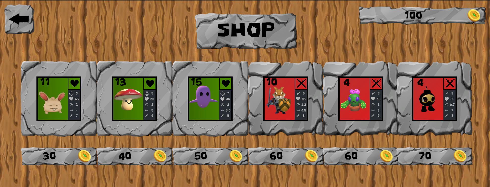

# IF3210-2024-Unity-BUG

## Deskripsi Aplikasi
Game ini merupakan lanjutan dan modifikasi dari Survival Shooter berdasarkan [tutorial Unity](https://www.youtube.com/playlist?list=PL871udVFq7OF9w5RBjyp_lcyzFuViLe8x). Versi Unity3D Hub yang dipakai adalah 2022.3.21f1.

Game ini memiliki storyline berupa Jirna yang mengalami mimpi buruk, di mana dirinya menjadi kecil dan dia harus mengalahkan mob-mob yang mengerumuni kamarnya. Dia kemudian mempelajari motif musuh sebenarnya...

Terdapat 4 buah jenis mob:
- Keroco: Makhluk berwarna pink yang gesit dan membawa katana.
- Kepala keroco: Makhluk kuning yang besar dan melompat, memiliki shotgun dan dapat meng-spawn keroco setiap 25 detik.
- Jenderal: Makhluk yang memiliki bentuk seperti iblis. Jenderal dapat menyerang dalam jarak dekat dan menggunakan sword sebagai alat serangnya. Jenderal mampu 
- Boss/Raja: Setiap ada pemain yang mendekatinya dalam jarak tertentu, pemain tersebut akan mengalami perlambatan gerak, penurunan nilai serangan, dan pengurangan nyawa tiap detik

Pemain memiliki 3 buah weapon:
- Gun: Menembak peluru yang memiliki range tidak terbatas. 
- Shotgun: Memiliki range dan waktu tembak terbatas, namun damage yang dihasilkan lebih kuat jika musuh lebih dekat.
- Katana: Mampu mengalahkan musuh dalam jarak dekat.

Setiap kali pemain menyelesaikan sebuah level, pemain akan memperoleh reward yang dapat digunakan untuk membeli pet di shop.

Terdapat 2 jenis pet yang dapat dibeli pemain di shop di town scene:
- Pet penyembuh (hijau): Pet ini dapat dimiliki oleh pemain. Karakteristik pet ini akan selalu mengikuti kemana pemain pergi. Pet berupa hantu, kelinci, jamur
- Pet penyerang (merah): Pet ini dapat dimiliki oleh pemain. Karakteristik pet ini akan selalu mendekati musuh terdekat dan menyerangnya. Pet berupa anjing, kaktus, dan bom
Terdapat pet increase yang hanya dimiliki jenderal dan raja (kelelawar, kura-kura, dan slime)

Beberapa orb yang dapat diambil pemain selama melakukan quest adalah sebagai berikut:
- Orb Increase Damage (merah): Orb ini meningkatkan damage pemain sebesar 10 persen dari base damage. Efek dari orb ini berlaku secara permanen
- Orb Restore Health (hijau): Orb ini mengisi ulang health pemain sebesar 20 persen
- Orb Increase Speed (kuning): Orb ini meningkatkan speed pemain sebesar 20 persen selama 15 detik

Pemain dapat melakukan save di toilet pada town scene, dan load ulang game saat di main menu.

Untuk memainkan game, clone repository ini, lalu buka Unity Editor, buka scene Main Menu dan play.

## Library yang digunakan
- Menggunakan library AI UnityEngine untuk mengikuti pergerakan pemain oleh musuh
- Menggunakan Serialization Formatter untuk meng-save file

## Screenshot aplikasi (dimasukkan dalam folder screenshot)

## Pembagian kerja anggota kelompok

| Nama                      | NIM       | Pembagian kerja     |
| ------------------------- | --------- | --------                                              |
| Bintang Hijriawan Jachja  | 13521003  | Model shopkeeper & pet, behavior dan ability pet |
| Jason Rivalino            | 13521008  | Model raja dan jenderal, weapon musuh, modifikasi ability dan behavior musuh  |
| M Farrel Danendra Rachim  | 13521048  | Membuat scene dialog/cerita, membuat town scene, cheat skip/motherlode, uang & shopkeeper, levels logic, poin musuh, game over    |
| Muhammad Fadhil Amri      | 13521066  | Model weapon dan orb, behavior weapon dan orb  |
| Akmal Mahardika N P       | 13521070  | Main Menu, statistik, settings, save/load game  |

## Jumlah jam persiapan dan pengerjaan untuk masing-masing anggota

| Nama                      | NIM       | Jam kerja     |
| ------------------------- | --------- | --------      |
| Bintang Hijriawan Jachja  | 13521003  | 55  |
| Jason Rivalino            | 13521008  | 55  |
| M Farrel Danendra Rachim  | 13521048  | 60  |
| Muhammad Fadhil Amri      | 13521066  | 60  |
| Akmal Mahardika N P       | 13521070  | 55  |